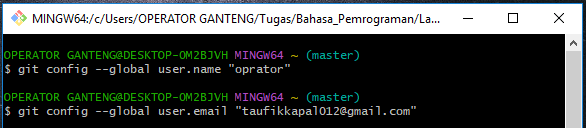

# LatihanVCS
## Tutorial cara penggunaan git

### Pertama kalian harus instal terlebih dahulu software Git Lalu kalian bisa buka software tersebut
kode tag untuk paragraf adalah "
"
ini adalah tampilannya
