# LatihanVCS
Tutorial cara penggunaan git

Pertama kalian harus instal terlebih dahulu software Git Lalu kalian bisa buka software tersebut

1.Login Git

Langkah pertama kalian adalah memasukan username dengan menggunakan perintah:

$ git config --global user.name "UsernameAnda"

lalu kalian tambahkan juga email dengan menggunakan perintah

$ git config --global user.email "email anda"

Buat folder dengan menggunakan perintah dan buka folder tersebut

$mkdir Tugas

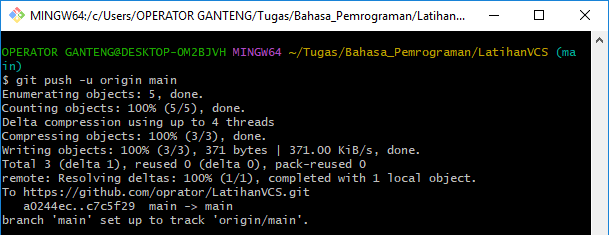

$cd Tugas

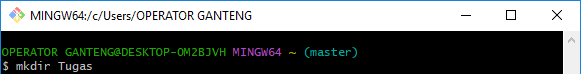

2.Login Github

Langkah kedua kalian bisa login ke dalam website github, Setelah kalian login akan muncul tampilan dashboard dari github tersebut

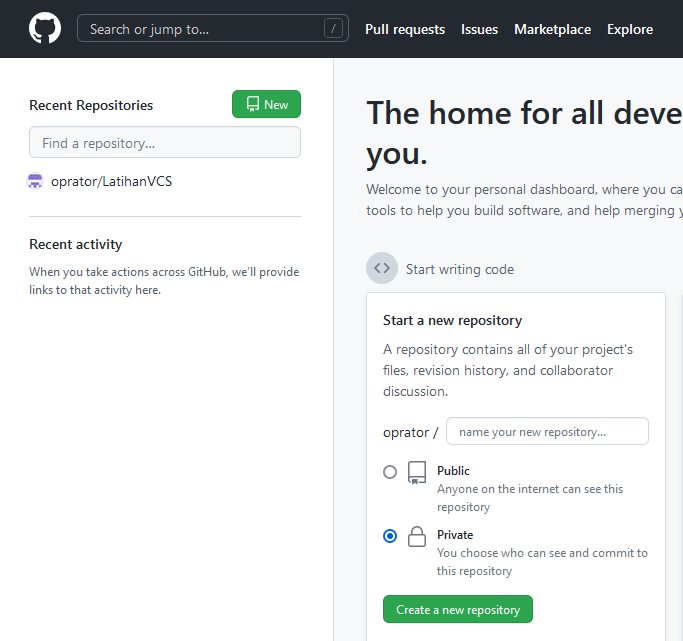

3.Membuat Repository Server

Setelah berhasil login ke GitHub, Anda bisa mulai membuat repository. Klik tombol New pada menu Repositories untuk membuat repository baru.

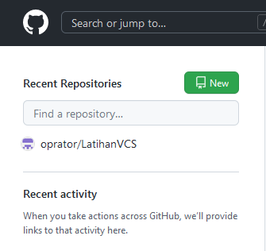

Kemudian kaliam akan diarahkan pada halaman untuk membuat repository baru seperti gambar di bawah ini.

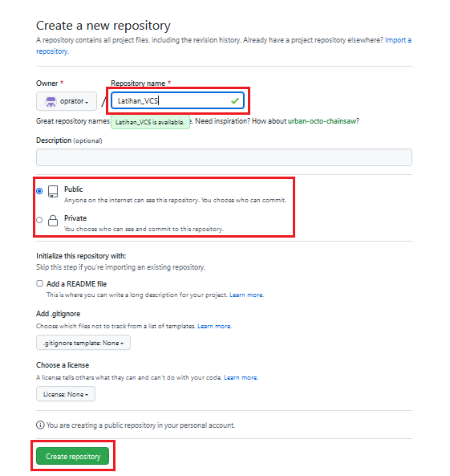

Jika sudah akan muncul tampilan seperti ini:

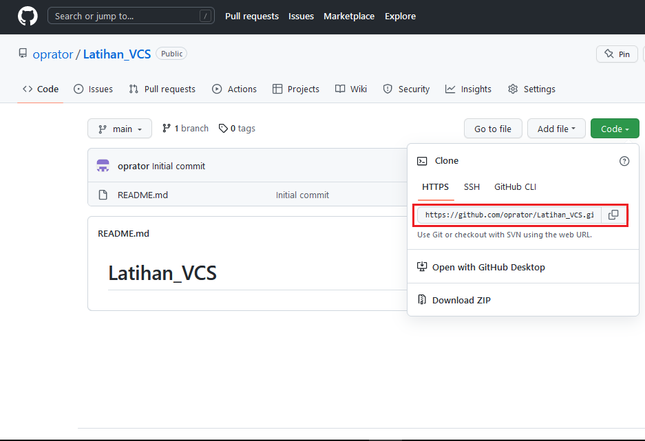

kalian langsung copy url dan masukan perintah

$ git clone https://github.com/oprator/LatihanVCS.git

untuk menampilkan file README.md 

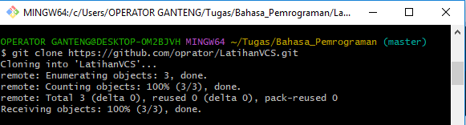

Untuk menambahkan file yang baru saja dibuat tersebut menggunakan perintah

$git add README.md

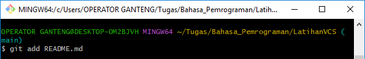

Untuk menyimpan perubahan yang ada kedalam database repository local, gunakan perintah

$ git commit -m "Menambahkan file"

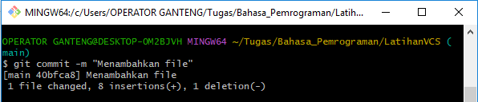

kemudian gunakan perintah

$git branch -M main

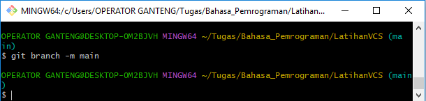

Setelah itu menambahkan remote repository. remote Repository merupakan repository server yang akan digunakan untuk menyimpan setiap perubahan pada local repository, sehingga dapat diakses oleh banyak user. dengan menggunakan perintah

$ git remote add origin https://github.com/oprator/LatihanVCS.git

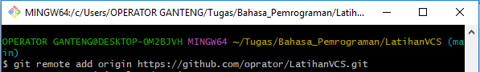

Dan untuk mengirim perubahan pada local repository ke server gunakan perintah

$git push -u origin main

Dan kita bisa cek di repository langsung pada website github